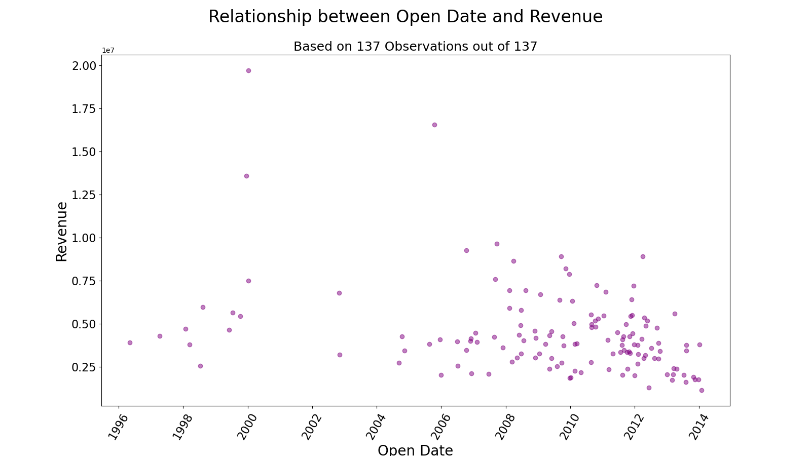

# **Hackathon**
### Predicting restaurant sales
###### Emily K. Sanders and Prab Jaswal, DSB-318, May 31, 2024
---

## Summary
We chose to look at the restaurant dataset, which was provided by the company in hopes of data science feedback on where to open new restaurants.  Our goal was to create a regression model, based on the predictive variables provided, to adequately predict the revenue of each restaurant.  

## Problem Statement
The restaurant industry has famously thin margins, so choosing where to open a new location is a high stakes game.  Having a model that can shed light on the profit potential of different locations would allow business decision makers to invest wisely.

The purpose of this project is to 
1. produce a predictive model to inform investors, and 
2. if possible, draw inferences about the factors affecting revenue.

## Metrics of Success
For each of our models, we will assess $R^2$, a measure of the variability in revenues that can be explained by the features in our model, as well as $RMSE$, which is a measure of how distant our predicted revenues are from their true counterparts.  $R^2$ is a proportion, reported as a float between |0| and |1|, and $RMSE$ is in the same units as the target, revenue.  

## Data
The datasets came from [Kaggle](https://www.kaggle.com/c/restaurant-revenue-prediction/data), and contain 42 predictive variables plus the target variable of revnue.  The predictive variables include the city the restaurant is located in, the date it opened, the type of city ("Big City" or "other"), and the type of restaurant ("inline," "food court," "drive through," or "mobile").  There were also 37 masked predictor variables.  The target variable was the revenue of the restaurant.  Revenue was subjected to an unspecifiedtransformation prior to the release of the dataset, and is presented in what we believe to be US dollars, although this is not explicitly specified either.

The dataset we did our modeling on had 137 rows and 43 columns, including the target.  The validation set provided had 100,000 rows and 42 columns, not including the target.  This presented some problems that we will address later in this report.

## Repository Structure
Within this repo, you will find 2 folders, and several loose files.  Here is a guide to them.
|File or Folder Name|Contents|Description|
|-------------------|--------|-----------|
|README.md|this file|An overview of our work and findings|
|restaurant_revenue_prediction.ipynb|Jupyter notebook|This notebook contains all of our work on this project.  It is a combination of both `.py` files.|
|train.csv|The original data.|This is the data as retrieved from Kaggle.  Although we did some minor recoding in the notebook, it did not require serious enough cleaning to warrant generating a new CSV.|
|images/|One subfolder containing many `.png` files.|Image files supporting this report.  These can be found in the single subfolder.|
|py_files/||`.py` files containing our work.  This work is also presented in our noteooks, but because these files are divided, and thus shorter, readers may find them more digestable.|
||01_functions.py|Definitions of several functions we used.|
||02_main_analyses.py|All of the work we did to import, clean, model, and interpret the data.|
|LICENSE|MIT license|A statement granting certain permissions for others to use our work.|
|.gitignore|n/a|Administrative file.|

## Data Cleaning
After retrieving the data from Kaggle, we embarked on data cleaning and preparation.  We were pleased to find no missing values in our modeling dataset, which would have only compounded the challenge of having such imbalanced sizes.  We opted to drop the `city` variable, because transforming it for use in the model would create 30+ additional columns - far too many to fit on so few rows.  We converted the `open date` variable to a `datetime` type, and then extracted only the month and year to use in the model.  Finally, we binarized the `type` variable.  Although there are 4 possible values of this variable, only 3 actually appeared in the modeling data, and one of them had only one observation.  
|Value|Meaning|Count|
|-----|-------|-----|
|'FC'|Food Court|76|
|'IL'|Freestanding Store|60|
|'DT'|Drive-Through|1|
|'MB'|Mobile (i.e., Food Truck)|0|

In order to make our analyses most useful, we collapsed these categories into "Food Court" or "not Food Court."  All masked variables were used as-is.

## Exploratory Data Analysis
We conducted the bulk of our EDA through graphs, which are included in the [images](./images) folder described above.  We discovered that many of the masked variables seemed to be categorical, and that few if any of the predictors had a clear linear relationship with revenue.  Several plots showed signs of outliers, but with so few observations to begin with, we opted not to sacrifice any.

## Modeling
We performed a train test split on our modeling data in order to have a "clean" section to test our models on.  Because of the small numbers of observations, we used 20%, rather than the customary 25%, of them in this reserved portion.

Our first attempt at a model was a multiple regression including all the features discussed above, which performed abysmally.  We attempted to correct this by introducing LASSO regularization, which did somewhat improve performance, but not by much.  When we investigated the coefficients LASSO found, we discovered that all coefficients except the one for `year` had been set to 0.  We therefore then fit a simple linear regression using only the year to predict revenue.  This was our best performing model, although it was still underwhelming.  The $R^2$ values for the year-only model were 0.099 in the training set and 0.094 in the testing set; whereas all $R^2$ values for previous models had been well under 0.05.  $RMSE$ values for our LASSO and year-only models were in the trillions, indicating extreme and costly mismatch between our predictions and the true revenues of these locations.

## Conclusions and Recommendations
From these data, the only feature that appears to have any predictive power is the year, whose coefficients in both LASSO and simple linear regression were large and negative (-173242.13 and -171386.19, respectively).  Although these coefficients have an impressive scale, they do not offer any useful business insights.  The simple linear regression model, which is the more interpretable of the two, suggests that new restaurants can increase their revenue by 171,386.19USD per year, but only if they are able to open backwards in time.  Put another way, the restaurants in our data, on average, generated $171,386.19USD less in revenue per every 1 year later that they opened.

Until and unless TFI masters time travel, we cannot make any useful predictions from these data with these models.

We believe that our lackluster results underscore an important trend in the restaurant industry: diminishing profitability.  Although these data only extend until 2014, we suspect that this trend could only be worse in a post-pandemic world.

If TFI would like to continue the search for a useful model, we request that they release the revenue figures for more restaurants.  Having only 137 cases on which to build a model meant to be applied to hundreds of thousands is a sub-par workflow and likely exacerbated the underlying, true difficulties of modeling such a thing.

